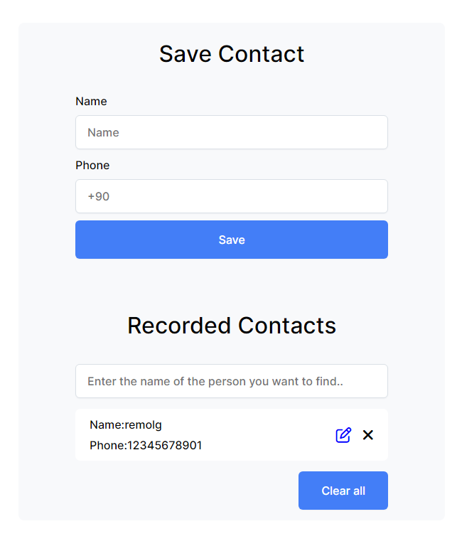
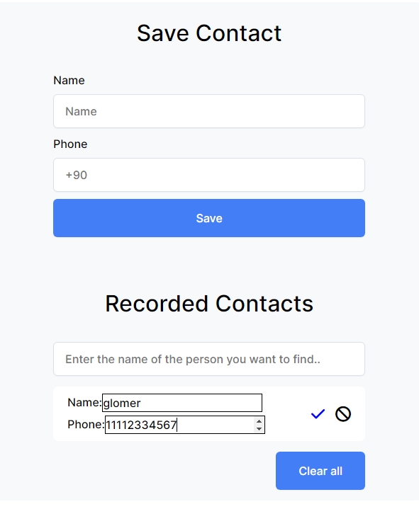
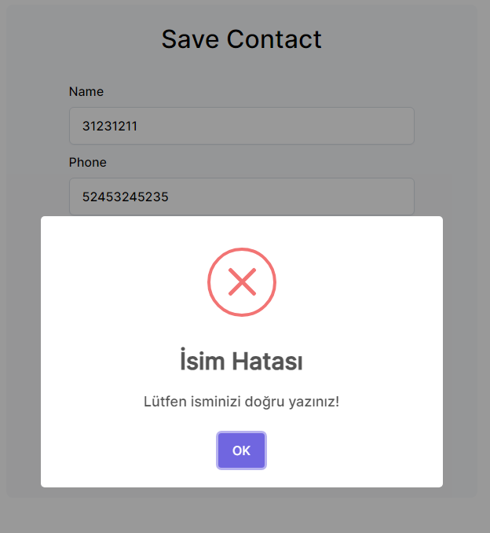

# Phonebook

This project is something I made to reinforce what I learned while learning JavaScript.

## What Can You Do

- You can add a name / phone number.

- You can change the name / phone number you added.

- You can delete the name / phone number you added.

- You can delete all the names and phone numbers you added at once.

- To prevent you from making wrong decisions, you will receive ARE YOU SURE messages for every deletion action you make.

- You will receive error messages upon incorrect fillings.

### For example

- You cannot enter numbers in the name field.

- You cannot enter letters in the number field.

  
## Run on Your Computer

Clone the project

```bash
  git clone https://github.com/remolg/Phonebook-app.git
```

Go to the project directory

```bash
  cd desktop
  
  cd "Phonebook-app"
```

Or You can go by clicking on the link

-[Phonebook App](https://sadikahmetozdemir.me/projects/Phonebook-app/index.html)







  
